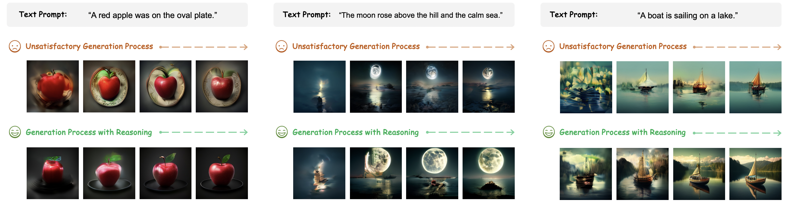
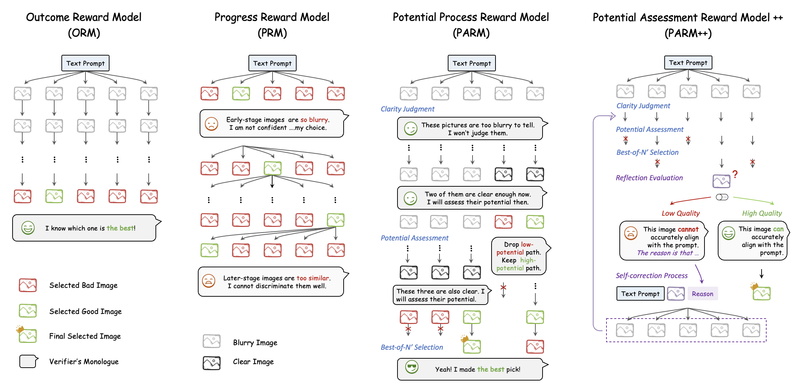

# Can We Generate Images 🌇 with CoT 🧠?

Official repository for the paper "[Can We Generate Images with CoT? Let's Verify and Reinforce Image Generation Step by Step](https://arxiv.org/pdf/2501.13926)".

[[📖 Paper](https://arxiv.org/pdf/2501.13926)] [[🤗 HF Checkpoints](https://huggingface.co/ZiyuG/Image-Generation-CoT)] [[🤗 HF Datasets (coming)]()]

## 💥 News
- **[2025.01.23]** We release the code and ckpts for autoregressive image generation with test-time scaling (ORM, PARM) and DPO 🚀
- **[2025.01.23]** We release the [arXiv paper](https://arxiv.org/pdf/2501.13926) 🚀

## 👀 Reasoning in Image Generation

Chain-of-Thought (CoT) reasoning has been extensively explored by LLMs and LMMs in mathematics. However, it still remains an open question whether such strategies can be applied to **verifying and reinforcing image generation scenarios**. In this project, we provide ***the first*** comprehensive investigation of the potential of CoT reasoning to enhance autoregressive image generation.

<p align="center">
     <br>
</p>

We focus on three CoT reasoning techniques:
1. ***Scaling Test-time Computation*** for verification (ORM, PRM, and our proposed PARM and PARM++)
2. ***Aligning Model Preferences*** with Direct Preference Optimization (DPO)
3. ***Integrating These Techniques*** for complementary effects

Our results demonstrate that these approaches can be effectively adapted and combined to significantly improve the image generation performance:

<p align="center">
     <br>
</p>
  
Furthermore, given the pivotal role of reward models in our findings, we propose the ***P***otential ***A***ssessment ***R***eward ***M***odel (***PARM***) and ***PARM++***, specialized for autoregressive image generation:

1. ***PARM*** adaptively assesses each generation step through a potential assessment approach, merging the strengths of existing reward models.
2. ***PARM++*** further introduces a reflection mechanism to empower generative models to self-correct the previous unsatisfactory image.

<p align="center">
     <br>
</p>

## 💪 Get Started
### Installation

Clone the repository:

   ```bash
   git clone https://github.com/ZiyuGuo99/Image-Generation-CoT.git
   cd Image-Generation-CoT
   ```

Create a conda environment:

   ```bash
   conda create -n img_cot python=3.10
   conda activate img_cot
   ```
   Please follow the instructions [here](https://pytorch.org/get-started/locally/) to install both PyTorch and TorchVision dependencies.

   Install additional dependencies:
   ```bash
   pip install -r requirements.txt
   git clone https://github.com/open-mmlab/mmdetection.git
cd mmdetection; git checkout 2.x
pip install -v -e .
git clone https://github.com/LLaVA-VL/LLaVA-NeXT && cd LLaVA-NeXT && pip install -e ".[train]"
   ```

### Prepare Checkpoints

   - Download reward models and DPO checkpoints from [this link](https://huggingface.co/ZiyuG/Image-Generation-CoT), and put then under `Image-Generation-CoT/ckpts/`.

   - Download the Mask2Former object detector for GenEval evaluation by running following command:
        ```bash
        mkdir geneval/evaluation/object
        bash geneval/evaluation/download_models.sh geneval/evaluation/object
        ```

### 0. Baseline Model ([Show-o](https://github.com/showlab/Show-o)) 🎨
Run the following command to use the baseline model:
```
torchrun --nnodes=1 --nproc_per_node=8 --node_rank=0 --master_port=12475 main.py \
--prompts_file geneval/prompts/generation_prompts.txt \
--metadata_file geneval/prompts/evaluation_metadata.jsonl \
--config config.yaml 
```
### 1. Scaling Test-time Computation 📈

#### 1.1. Zero-shot ORM
Run the following command to use the zero-shot ORM:
```
torchrun --nnodes=1 --nproc_per_node=8 --node_rank=0 --master_port=12475 main.py \
--prompts_file geneval/prompts/generation_prompts.txt \
--metadata_file geneval/prompts/evaluation_metadata.jsonl \
--config config.yaml \
--reward_model orm_zs 
```
#### 1.2. Fine-tuned ORM
Run the following command to use the fine-tuned ORM:
```
torchrun --nnodes=1 --nproc_per_node=8 --node_rank=0 --master_port=12475 main.py \
--prompts_file geneval/prompts/generation_prompts.txt \
--metadata_file geneval/prompts/evaluation_metadata.jsonl \
--config config.yaml \
--reward_model orm_ft
```
#### 1.3. PARM
Run the following command to use PARM:
```
torchrun --nnodes=1 --nproc_per_node=8 --node_rank=0 --master_port=12475 main.py \
--prompts_file geneval/prompts/generation_prompts.txt \
--metadata_file geneval/prompts/evaluation_metadata.jsonl \
--config config.yaml \
--reward_model parm 
```
### 2. Preference Alignment with DPO 🔧

#### 2.1. Initial DPO
Run the following command to use intial DPO:
```
torchrun --nnodes=1 --nproc_per_node=8 --node_rank=0 --master_port=12475 main.py \
--prompts_file geneval/prompts/generation_prompts.txt \
--metadata_file geneval/prompts/evaluation_metadata.jsonl \
--config config.yaml \
--dpo_model dpo
```
#### 2.2. Iterative DPO
Run the following command to use iterative DPO:
```
torchrun --nnodes=1 --nproc_per_node=8 --node_rank=0 --master_port=12475 main.py \
--prompts_file geneval/prompts/generation_prompts.txt \
--metadata_file geneval/prompts/evaluation_metadata.jsonl \
--config config.yaml \
--dpo_model dpo_iter
```
#### 2.3. Iterative DPO with PARM Guidance
Run the following command to use iterative DPO with PARM guidance:
```
torchrun --nnodes=1 --nproc_per_node=8 --node_rank=0 --master_port=12475 main.py \
--prompts_file geneval/prompts/generation_prompts.txt \
--metadata_file geneval/prompts/evaluation_metadata.jsonl \
--config config.yaml \
--dpo_model dpo_iter_parm_gudie
```
### 3. Reasoning Strategy Integration 🧩

#### 3.1. Iterative DPO with PARM Guidance + PARM
Run the following command to combine iterative DPO with PARM guidance and PARM:
```
torchrun --nnodes=1 --nproc_per_node=8 --node_rank=0 --master_port=12475 main.py \
--prompts_file geneval/prompts/generation_prompts.txt \
--metadata_file geneval/prompts/evaluation_metadata.jsonl \
--config config.yaml \
--reward_model parm \
--dpo_model dpo_iter_parm_gudie
```

## :white_check_mark: Citation

If you find this project useful for your research or applications, please kindly cite using this BibTeX:

```latex
@misc{guo2025generateimagescotlets,
      title={Can We Generate Images with CoT? Let's Verify and Reinforce Image Generation Step by Step}, 
      author={Ziyu Guo and Renrui Zhang and Chengzhuo Tong and Zhizheng Zhao and Peng Gao and Hongsheng Li and Pheng-Ann Heng},
      year={2025},
      eprint={2501.13926},
      archivePrefix={arXiv},
      primaryClass={cs.CV},
      url={https://arxiv.org/abs/2501.13926}, 
}
```


## 🧠 Related Work

Explore our additional research on **CoT Reasoning** and **3D Vision**:

- **[MathVerse]** [MathVerse: Does Your Multi-modal LLM Truly See the Diagrams in Visual Math Problems?](https://mathverse-cuhk.github.io/)
- **[MAVIS]** [MAVIS: Mathematical Visual Instruction Tuning with an Automatic Data Engine](https://arxiv.org/pdf/2407.08739)
- **[SAM2Point]** [SAM2Point: Segment Any 3D as Videos in Zero-shot and Promptable Manners](https://sam2point.github.io/)
- **[Point-Bind & Point-LLM]** [Multi-modality 3D Understanding, Generation, and Instruction Following](https://github.com/ZiyuGuo99/Point-Bind_Point-LLM)
- **[MMSearch]** [MMSearch: Unveiling the Potential of Large Models as Multi-modal Search Engines](https://mmsearch.github.io/)
